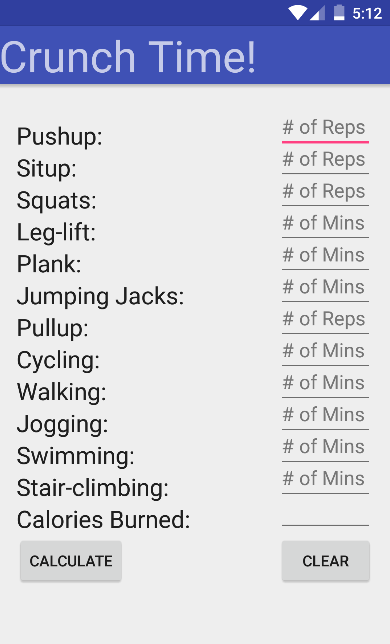
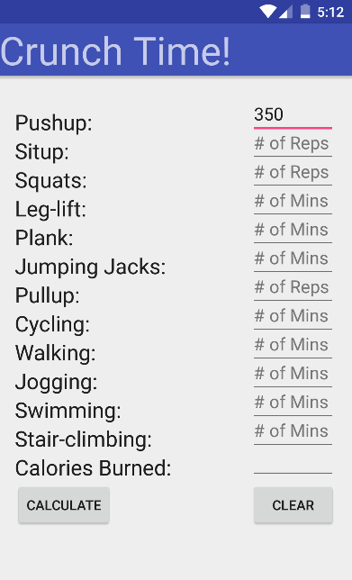
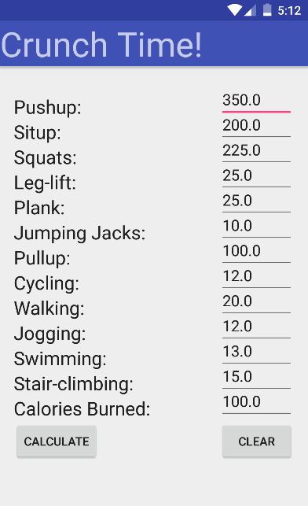
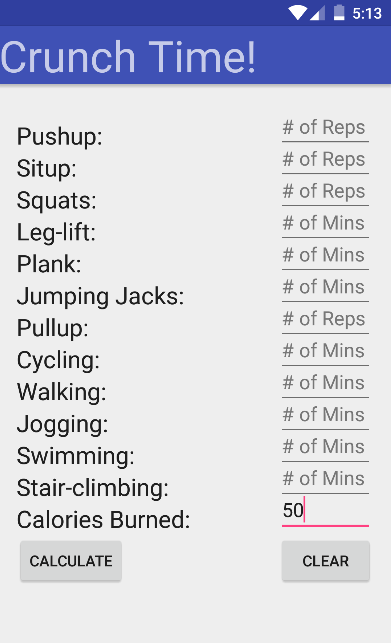
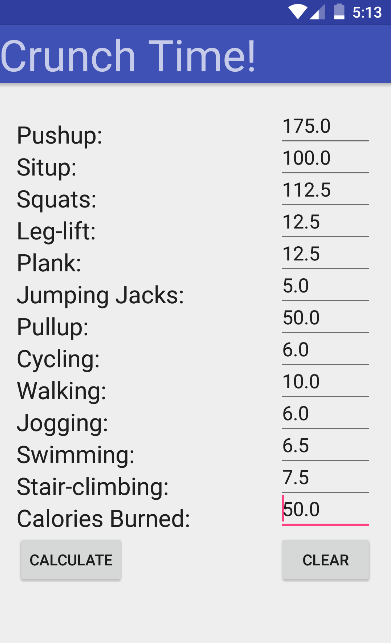

# PROG 01: Crunch Time

The title of my project is 'Crunch Time!' First, it allows the user to input the number of reps or minutes s/he did for a certain exercise. Then, the user can see how many calories s/he has burned, along with an equivalent number of reps or minutes needed to burn the same number of calories for each of the other exercises. Lastly, the user can also enter the number of calories s/he wants to burn to see the reps or minutes of exercises needed to burn his/her target amount of calories.

## Title Image

## Authors

Brian Chang ([brian.chang@berkeley.edu](mailto:brian.chang@berkeley.edu))

## How It Works

From the list of exercises, select one by entering the number of reps or minutes you completed on the right hand side. Next, press the 'Calculate' button and it will display the number of calories burned on the bottom row. Each exercise on the left has a corresponding number on the right that specifies the amount of reps or minutes needed to burn an equivalent number of calories. To select another exercise, first press the 'Clear' button. Another feature of this app allows the user to enter the number of calories s/he wants to burn on the bottom right input field. Press the 'Calculate' button and similarly, each exercise on the left will have a corresponding number on the right that specifies the amount of reps or minutes needed to burn this target number of calories. Note: the user should always clear the results before starting another trial.

## Demo Video

See [Crunch Time!] (https://vimeo.com/154377019) on Vimeo!

## Screenshots

## Acknowledgments

I'd like to thank the CS160 TAs for helping me set up Android SDK.
